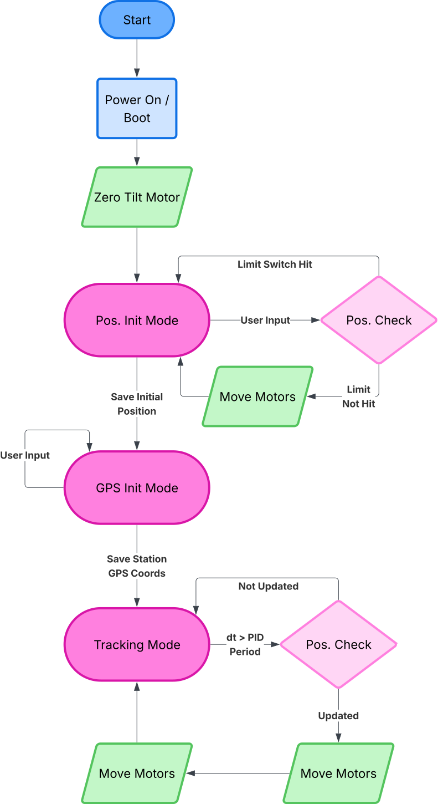

# Tracking Beacon Firmware

STM32F446 microcontroller firmware for an automated antenna tracking system using stepper motors and RSSI-based direction finding.

## Overview

This firmware implements a real-time tracking beacon system that:
- Controls two stepper motors (azimuth and elevation) for antenna positioning
- Reads RSSI (Received Signal Strength Indicator) from 5 antenna elements
- Provides manual alignment and automatic tracking capabilities
- Supports passthrough communication between ground station and beacon

## Hardware

**MCU:** STM32F446xx @ 84 MHz  
**Motors:** 2 stepper motors (azimuth & elevation control)  
**Antennas:** 5 receive elements (4 outer + 1 center for null-steering array)  
**Communication:** 6 UART/USART channels with DMA support

### Pin Configuration

| Component | Pin | Port | Purpose |
|-----------|-----|------|---------|
| Stepper 1 (Az) Direction | PB13 | GPIOB | Azimuth motor direction |
| Stepper 1 (Az) Pulse | PB14 | GPIOB | Azimuth motor step |
| Stepper 2 (El) Direction | PB1 | GPIOB | Elevation motor direction |
| Stepper 2 (El) Pulse | PB15 | GPIOB | Elevation motor step |
| User Button | PC13 | GPIOC | Manual input trigger |
| LED Output | PA5 | GPIOA | Status indicator |

## Communication Channels

| UART | Baud Rate | Purpose |
|------|-----------|---------|
| USART1 | 57600 | Center antenna (RSSI) |
| USART2 | 115200 | Manual alignment input |
| USART3 | 57600 | Outer antenna 1 (RSSI) |
| UART4 | 57600 | Outer antenna 2 (RSSI) |
| UART5 | 57600 | Outer antenna 3 (RSSI) |
| USART6 | 57600 | Outer antenna 4 (RSSI) |

## Core Modules

### Stepper Module (`stepper.c/h`)
Manages stepper motor control for antenna positioning:
- Tracks position for azimuth (AZ) and elevation (EL) axes
- Supports configurable step intervals
- Provides zero position calibration
- Non-blocking stepping with polling-based execution

**Key Functions:**
- `Stepper_Init()` - Initialize GPIO and timing
- `Stepper_Step()` - Execute single step on specified axis
- `Stepper_SetTarget()` - Set target position with automatic movement
- `Stepper_Poll()` - Non-blocking motor control polling
- `Stepper_ZeroPosition()` - Calibrate current position as zero

### RSSI Module (`rssi.c/h`)
Processes signal strength measurements from 5 antenna elements:
- Receives RSSI telemetry via UART (DMA-based)
- Tracks activity status and timestamps for each antenna
- Provides signal strength readings for tracking algorithms

**Antenna Mapping:**
- Index 0-3: Outer antenna elements (USART3, UART4, UART5, USART6)
- Index 4: Center antenna element (USART1)

### Setup Module (`setup.c/h`)
Handles system initialization and manual control:
- **Manual Alignment Phase:** Blocks during startup for user-directed motor positioning
- **Active Mode:** Accepts WASD keyboard commands for real-time antenna adjustment
- Provides interactive feedback via UART2 echo

### Passthrough Module (`passthrough.c/h`)
Bidirectional data relay between ground station and beacon:
- Routes messages between different UART channels
- Manages buffering for asynchronous communication
- Supports concurrent Rx/Tx operations with DMA

## System State Machines



## Building

Requires CMake 3.20+ and ARM GCC toolchain:

```bash
cmake --preset default
cmake --build --preset default
```

## Flashing

Connect STM32F446 via USB and use ST-Link or your preferred programming tool:

```bash
# Using STM32CubeProgrammer or OpenOCD
openocd -f interface/stlink.cfg -f target/stm32f4x.cfg \
  -c "program build/tracking-beacon-firmware.elf verify reset exit"
```

## Usage

### Startup Sequence
1. Power on STM32F446
2. Enter **Manual Alignment** mode (blocks execution)
3. Use UART2 terminal (115200 baud) to send WASD commands
4. Press **ENTER** to exit alignment and start tracking
5. System enters main loop with active tracking

### Runtime Commands
- **W** - Increase elevation
- **A** - Decrease azimuth (CCW)
- **S** - Decrease elevation
- **D** - Increase azimuth (CW)

### Monitoring
Connect to UART2 (115200 baud) to observe:
- Manual alignment prompts
- Echo of keyboard input
- Motor position feedback

## Project Structure

```
Core/
├── Inc/           # Header files
│   ├── main.h
│   ├── stepper.h
│   ├── rssi.h
│   ├── setup.h
│   └── passthrough.h
└── Src/           # Implementation files
    ├── main.c
    ├── stepper.c
    ├── rssi.c
    ├── setup.c
    ├── passthrough.c
    └── ... (HAL generated files)

Drivers/           # STM32 HAL libraries
cmake/             # Build configuration
```

## Key Features

- **Non-Blocking Architecture:** All modules use polling/DMA to avoid blocking the main loop
- **Multi-UART Support:** 6 independent serial channels with DMA transfers
- **Stepper Abstraction:** Clean API for motor control independent of GPIO configuration
- **Manual + Auto Control:** Supports both interactive alignment and algorithmic tracking
- **Signal Processing:** Real-time RSSI monitoring from antenna array
- **Error Handling:** Graceful degradation with activity timeouts

## Future Enhancements

- Implement automatic tracking algorithm using RSSI null-steering
- Add PID control for smooth motor movements
- SD card logging of tracking data
- Network communication for remote control
- Kalman filtering for noisy RSSI measurements

## License

This project is provided as-is under the terms found in the LICENSE file.

## References

- **STM32F446 Datasheet:** ARM Cortex-M4 @ 84 MHz
- **ST HAL Documentation:** Hardware Abstraction Layer API reference
- **Antenna Array Design:** Null-steering with 5-element cross configuration