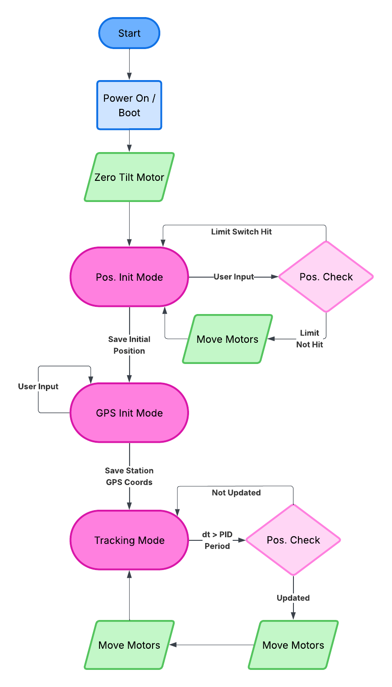

# Tracking Beacon Firmware

STM32F446 microcontroller firmware for an automated antenna tracking system using stepper motors and RSSI-based direction finding.

## Overview

This firmware implements a real-time tracking beacon system that:
- Controls two stepper motors (azimuth and elevation) for antenna positioning
- Provides manual alignment and automatic tracking capabilities
- Supports passthrough communication between ground station and beacon

## Hardware

**MCU:** STM32F446xx @ 84 MHz  
**Motors:** 2 stepper motors (azimuth & elevation control)  
**Antennas:** 5 receive elements (4 outer + 1 center for null-steering array)  
**Communication:** 6 UART/USART channels with DMA support

### Pin Configuration

| Component | Pin | Port | Purpose |
|-----------|-----|------|---------|
| Stepper 1 (Az) Direction | PB13 | GPIOB | Azimuth motor direction |
| Stepper 1 (Az) Pulse | PB14 | GPIOB | Azimuth motor step |
| Stepper 2 (El) Direction | PB1 | GPIOB | Elevation motor direction |
| Stepper 2 (El) Pulse | PB15 | GPIOB | Elevation motor step |
| User Button | PC13 | GPIOC | Manual input trigger |
| LED Output | PA5 | GPIOA | Status indicator |

## Communication Channels

| UART | Baud Rate | Purpose |
|------|-----------|---------|
| USART1 | 57600 | Center antenna (RSSI) |
| USART2 | 115200 | Manual alignment input |
| USART3 | 57600 | Outer antenna 1 (RSSI) |
| UART4 | 57600 | Outer antenna 2 (RSSI) |
| UART5 | 57600 | Outer antenna 3 (RSSI) |
| USART6 | 57600 | Outer antenna 4 (RSSI) |

## System State Machines

## Building

IN PROGRESS

## Flashing

IN PROGRESS

## Usage

### Startup Sequence
1. Power on STM32F446
2. Enter **Manual Alignment** mode (blocks execution)
    - Use UART2 terminal to send WASD commands
    - Press **ENTER** to exit alignment
3. Enter **GPS Initialization** mode (blocks execution)
    - Use UART2 terminal to send GPS coordinates
    - Press **ENTER** to exit initialization
4. System enters main loop with active tracking

### Runtime Commands
- **W** - Increase elevation
- **A** - Decrease azimuth (CCW)
- **S** - Decrease elevation
- **D** - Increase azimuth (CW)

## To Do Features
- Overall state machine implementation
- Manual tracking input
- GPS coordinate input
- Logic of current angle
- Protobuf implementation for passthrough data 
- Communication with Helios through UART for manual tracking, GPS inputs, and packet delivery
- Monopulse PID tracking
- Limit switch implementation